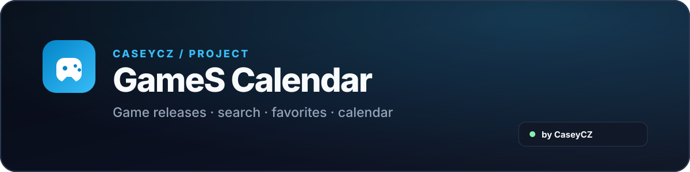

  

  
  

  Herní kalendář a vyhledávač, který na jednom místě ukazuje <strong>co vychází, kdy a na jaké platformě</strong>.

  

  

## O projektu

**GameS Calendar** vznikl jako rychlý přehled herních vydání bez nutnosti procházet několik různých webů. Umožňuje vyhledat hru, filtrovat vydání podle platformy nebo období, uložit oblíbené tituly a přidat datum vydání do kalendáře.

## Data a kvalita

- živé hledání používá IGDB a doplňkové oficiální katalogy i mimo lokální seznam her
- přesné datum, oznámený měsíc, čtvrtletí a rok se vedou odděleně, aby se orientační termín netvářil jako potvrzený den
- web načítá zmenšený katalog pro rychlé zobrazení a plná metadata až při otevření detailu
- automatické kontroly hlídají strukturu katalogu, duplicity, podezřelé termíny a regresní scénáře vyhledávání

## Architektura

- `games-index.json` je kompaktní katalog pro rychlé první načtení; plný `games.json` zůstává datovým zdrojem a nouzovým fallbackem
- živé vyhledávání a detail hry obsluhuje GameS API s IGDB, Steam, Xbox, PlayStation, Nintendo a GeForce NOW providery
- katalog se lehce obnovuje denně z IGDB; hlubší obohacení metadat běží samostatně a všechny workflow zapisující katalog jsou serializované
- release záznam nese vlastní přesnost (`day / month / q1–q4 / year / unknown`) a původ této přesnosti, aby orientační termíny nebyly prezentované jako potvrzené datum
- CI spouští syntax check, regresní smoke testy, datový audit a kontrolu velikosti kompaktního katalogu

### Audit 3.11

- vyhledávání respektuje aktivní platformy, žánry, studio, sérii a sledované hry i při globálním IGDB hledání
- opravené rozlišení PS4 / PS5 / Xbox Series / Xbox One / Xbox 360 včetně názvu IGDB `Series X|S`
- kompaktní katalog používá sparse schéma a má výkonový limit 3,2 MiB; prázdná/defaultní pole už se neposílají
- mobilní ovládání má větší dotykové cíle a čitelnější malé texty
- writer workflow jsou oddělené podle odpovědnosti a každý zápis dat prochází regresními a datovými kontrolami

## Hlavní funkce

- 🔍 vyhledávání připravovaných i vydaných her
- 🎮 filtry podle platformy, období, žánru a stavu vydání
- ❤️ vlastní seznam oblíbených / sledovaných her
- ⏳ odpočet do vydání
- 📖 detail hry s popisem a důležitými informacemi
- 🔗 odkazy na oficiální stránky, obchody, YouTube a další zdroje
- 📅 přidání vydání do Google Calendar, Apple Calendar nebo Outlooku
- 🔁 sdílení aktuálního výběru a filtrů
- 📱 pohodlné použití na telefonu i desktopu

## Podpora

  

   
  Naskenuj QR kód nebo klikni na tlačítko.

  

